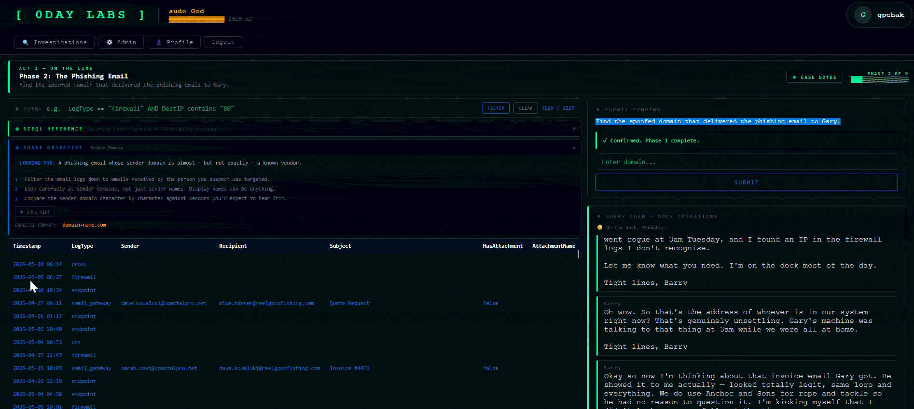
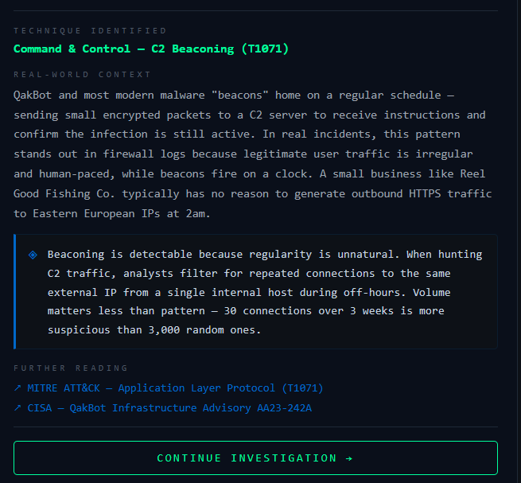

# 🎣 Phish & Ships: Maritime Supply Chain Attack (Design Case Study)

**Focus:** OSINT Integration & Hybrid Threat Profiling  
**Difficulty:** Rookie | **Duration:** 9 Phases | **Architecture:** Multi-Tool Investigation

> *Reel Good Fishing Co. has been targeted by a phishing campaign spoofing a primary client. Operatives must coordinate with Barry Chen, the company’s onsite contact, to triage internal logs before pivoting to real-world threat intelligence sources to neutralize a QakBot infection.*

← [Back to 0Day Labs Overview](README.md)

---

## The Design Challenge
Most training environments are "closed loops" where all answers exist within a single interface. **Phish & Ships** was designed to break this mold by requiring a **Hybrid Workflow**. 

The simulation mirrors the reality of a Tier 1 SOC Analyst: internal logs provide the initial "scent," but verification requires the use of the live internet. By forcing operatives to leave the platform to query real-world databases, the simulation builds "tool-switching" muscle memory and teaches the importance of external validation.

---

## Data Architecture & Schema
The Reel Good Fishing Co. environment uses a diverse log set to simulate a small-business network under attack. Operatives must cross-reference email metadata with network flows to find the point of origin.

| Log Source | Investigative Purpose |
|---|---|
| `email_gateway` | Auditing inbound traffic for typosquatted client domains and malicious attachments. |
| `firewall` | Identifying persistent beaconing patterns and non-standard port usage. |
| `endpoint` | Tracing malicious process trees (e.g., Office applications spawning loaders). |
| `dhcp` | Correlating assigned IP addresses to specific physical hostnames. |
| `notes` | Reviewing internal context and suspect reports from the onsite IT contact. |

---

## Investigative Methodology

### Act I: Internal Triage (Log Analysis)
The investigation begins with a service ticket regarding suspicious outbound traffic from a primary workstation.
*   **The Challenge:** Operatives must parse through routine network noise to identify a specific external IP beaconing during non-business hours. This is followed by an audit of the `email_gateway` to locate the typosquatted domain used to deliver the payload.
*   **Skill Demonstrated:** **Traffic Analysis & Email Header Forensics.** Identifying the subtle difference between a legitimate client domain and a spoofed variant.

### Act II: Threat Enrichment (OSINT)
Once the Command & Control (C2) IP is identified, the investigation moves to the open web.
*   **The Challenge:** Operatives must use tools like **VirusTotal**, **AbuseIPDB**, and **AlienVault OTX** to establish a reputation score for the C2 IP. This act transitions the operative from "What happened?" to "Who is attacking us?"
*   **Skill Demonstrated:** **External Threat Intelligence.** Navigating live databases to identify malware families (QakBot) and geographic attribution.

### Act III: Attribution & Reporting
The final phases focus on gathering actionable intelligence and infrastructure analysis.
*   **The Challenge:** Using **Shodan** to find open ports used for evasion and researching official **CISA/FBI Advisories** to map the local incident to a global campaign.
*   **Skill Demonstrated:** **Advanced Research & Compliance.** Validating technical findings against official federal threat reports.

---

## Visual Walkthrough

### [Video: Hybrid Workflow]
<!-- 
RECOMMENDED: A 30-second screen recording showing:
1. Identifying the beaconing IP in SIEQL.
2. Interacting with Barry Chen in the chat panel.
3. Pivoting to an external browser tab (VirusTotal/Shodan).
-->

### [Screenshot: The Instructional Layer]
<!-- 
RECOMMENDED: A screenshot of a debrief card or Barry Chen's chat interaction.
-->

---

## Technique Mapping
This simulation provides hands-on practice with the following techniques:

*   **Phishing (T1566):** Analyzing typosquatted domains.
*   **Command and Control Beaconing (TA0011):** Identifying periodic heartbeat traffic in firewall logs.
*   **Command and Scripting Interpreter (T1059):** Tracing malware back to a parent process.
*   **Non-Standard Port (T1571):** Utilizing external OSINT sources to identify C2 communication over unexpected ports.
*   **Threat Intelligence (M1019):** Leveraging external OSINT sources to build a comprehensive threat profile.

---

## The Human Element: Barry Chen
A core component of the simulation is the interaction with **Barry Chen**, the company's unofficial IT person. Barry provides the "boots on the ground" perspective through a chat panel. While helpful, Barry is not a security professional, requiring the operative to translate technical findings into actionable requests for a non-technical stakeholder.

---

*← [Back to 0Day Labs Overview](README.md)*
