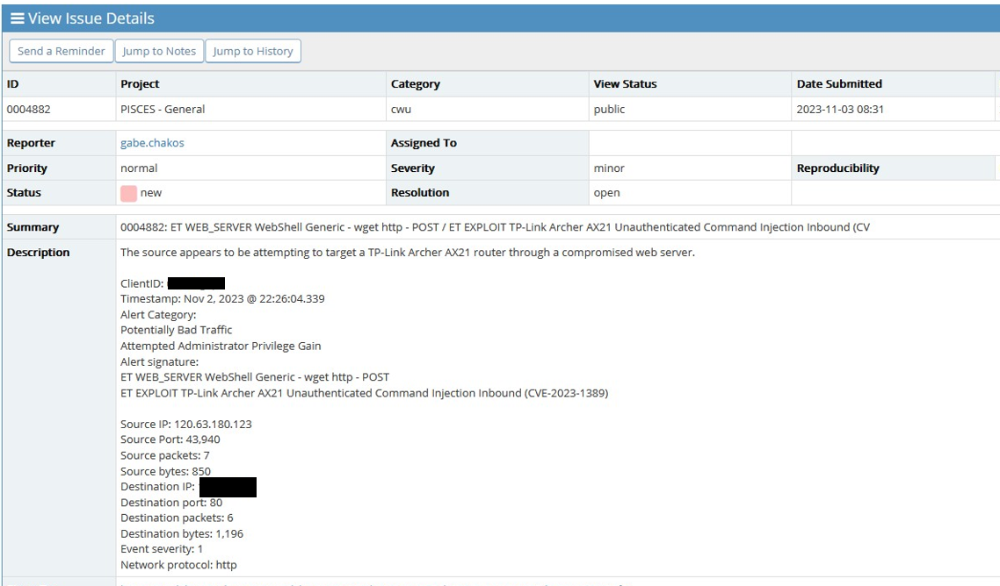

# Investigation: TP-Link Router Exploit Attempt (CVE-2023-1389)

## Investigation Summary

This investigation documents the detection of potential exploitation attempts targeting vulnerable TP-Link routers. The activity was detected through Suricata intrusion 
detection alerts and investigated using threat intelligence resources to determine whether the traffic was associated with known exploitation campaigns.

## Tools Used

- Elastic Stack (SIEM)
- Kibana (Dashboard visualization)
- Suricata (Intrusion Detection System)
- VirusTotal (Threat intelligence)
- GreyNoise (Internet scanning intelligence)
- AbuseIPDB (IP reputation analysis)
- CVE Details (Vulnerability reference)
- NIST (National Institute of Standards and Technology)

## Overview

During routine monitoring of network telemetry, intrusion detection alerts indicated possible exploitation attempts targeting a known vulnerability affecting TP-Link routers. The alerts referenced signatures associated with CVE-2023-1389, a command injection vulnerability that allows attackers to execute arbitrary commands on affected devices.

## Monitoring Environment

Network traffic was monitored through the SIEM platform using Suricata intrusion detection alerts and Kibana dashboards for visualization and analysis.

## Detection

While reviewing Suricata intrusion detection alerts within the SIEM environment, several alerts were observed indicating possible exploitation attempts targeting TP-Link router devices.

The alerts referenced signatures associated with CVE-2023-1389, a command injection vulnerability that allows remote attackers to execute arbitrary commands on affected devices. This vulnerability has been widely exploited in automated scanning campaigns targeting exposed routers.

Due to the potential severity of this vulnerability and its known exploitation in botnet activity, the alerts were selected for further investigation.

## Investigation Process

The following steps were taken to analyze the activity:

1. Reviewed the Suricata alert signatures associated with the event.
2. Examined the source IP address responsible for generating the alerts.
3. Investigated the reputation of the source IP using multiple threat intelligence platforms.
4. Reviewed related alerts within the SIEM to determine whether the activity occurred repeatedly or was part of a broader scanning pattern.
5. Evaluated whether the traffic patterns were consistent with automated exploitation attempts.

## Threat Intelligence Findings

The source IP address associated with the alerts was investigated using multiple threat intelligence platforms.

The investigation revealed:

- Previous abuse reports associated with the IP address
- Indicators of automated scanning behavior
- Similar activity reported across other networks targeting router vulnerabilities

These findings suggested the activity was likely part of automated scanning campaigns attempting to exploit vulnerable routers.

## Analysis

CVE-2023-1389 is a command injection vulnerability affecting certain TP-Link router models. The vulnerability allows attackers to execute commands remotely on vulnerable devices, potentially allowing them to gain control of the device.

Threat actors have widely exploited this vulnerability in large-scale scanning campaigns designed to identify vulnerable devices connected to the internet.

The alert signatures and traffic patterns observed during the investigation were consistent with automated reconnaissance or exploitation attempts targeting this vulnerability.

## Investigation Ticket

After completing the investigation and documenting the relevant findings, the event was submitted through the incident tracking system for review by monitoring personnel.

The ticket included details of the alerts, threat intelligence findings, and supporting analysis from the investigation.

## Conclusion

Based on the alert signatures, threat intelligence findings, and traffic patterns observed during the investigation, the activity was assessed to be consistent with automated scanning activity targeting the CVE-2023-1389 router vulnerability.

The event was documented and escalated through the incident tracking system to ensure visibility and further review by monitoring personnel.

## Response

Following submission of the investigation ticket, the activity continued to be monitored for additional related alerts or patterns that could indicate ongoing exploitation attempts.

## References

- https://www.cvedetails.com/cve/CVE-2023-1389/
- https://nvd.nist.gov/vuln/detail/CVE-2023-1389
